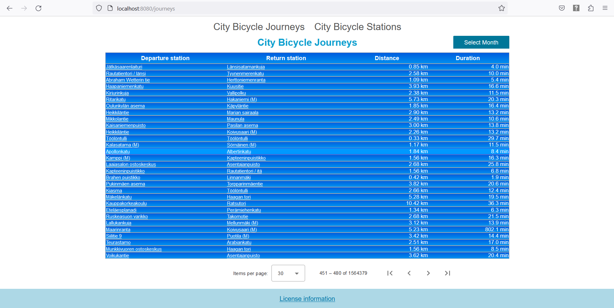

This is my Helsinki City Bicycle Journeys App which uses open data for backend.

## Table of contents
* [General info](#general-info)
* [Screenshot](#screenshot)
* [Technologies](#technologies)
* [Setup](#setup)
* [Links](#links-and-installation)
* [Features](#features)
* [Status](#status)

## General info
In this app the user can
* View Helsinki region City Bicycle Journey data from May, June and July of 2021
* Sort the data by clicking on table headers
* Filter data by using the Month menu
* Click on Station names in the Journeys table for details
* View Stations and their details

## Screenshot

## Technologies
This project has been created with
* Angular.js Frontend
* Java Spring Boot Backend
* H2 database with JPA

## Setup
First download the 4 CSV files from the Github release 
(zipped to reduce file size). 
They are the same that can be downloaded from here: 

Helsinki Region Transport's (HSL) City Bicycle Stations csv file is from here:
 
https://opendata.arcgis.com/datasets/726277c507ef4914b0aec3cbcfcbfafc_0.csv

The City Bicycle Journey csv files are from here:
 
https://dev.hsl.fi/citybikes/od-trips-2021/2021-05.csv  
https://dev.hsl.fi/citybikes/od-trips-2021/2021-06.csv  
https://dev.hsl.fi/citybikes/od-trips-2021/2021-07.csv

To run the project:

Unzip and put these four csv files into a directory named csv. 
Then put the directory csv in the same directory as the attached jar file is in.
 
Then run this in command prompt in the directory that the jar file is in: 
java -jar citybicyclejourneys-v1.0.jar

Or place the csv folder in the project root directory (where this README is in)
 
and either run these in command prompt in that same project root directory:
 
mvn compile 
mvn spring-boot:run 
or alternatively run the CityBicycleJourneys file (that is in backend) in an IDE

Then follow the console info. After the Station and the 3 Journey datasets have
 
been imported which takes about 3 to 10 minutes, open a browser window and type:
 
http://localhost:8080

## Links and installation

Install or update these to be able to run the app. To check if you have the 
correct version installed, run these in command prompt

* java --version (Java JDK 21)
* mvn --version  (Apache Maven 3.9.6 or later)
* node --version (Node 20.11.0 (LTS) or later, only LTS version works in my app)
* npm --version  (npm is included with Node - so install only Node (LTS))
* ng version     (Angular CLI version 17.1.3 or later)

## Features

CSV data validation and import:
* Journeys lasting less than ten seconds are excluded
* Journeys covering distance less than 10 meters are excluded

Bicycle Journeys table:
* Departure and return stations
* Distance in kilometers
* Duration in minutes
* Paginated
* Sorting per column
* Filtering per month

Bicycle Stations list
* Paginated

Single station view
* Station name and address
* Total number of journeys starting from the station
* Total number of journeys ending at the station
* Average distance of a journey starting from the station
* Average distance of a journey ending at the station
* Filtering all calculations per month

## Status

The project is complete